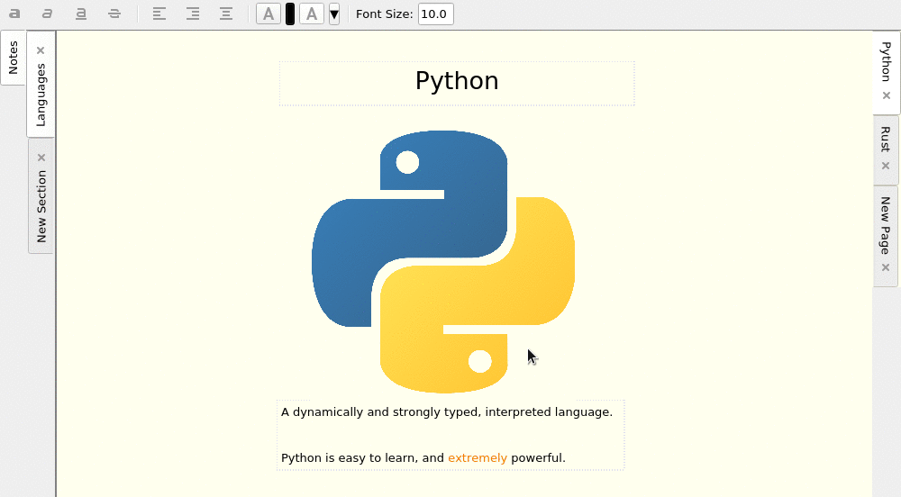

## Free Note

Free Note is an attempt to create a free and open source alternative to Microsoft's One Note. 
It's not a direct clone (certainly not now, but I also never intend it to be).
The major desire is to match OneNote's style of click-anywhere and start typing, move text around freely
in an infinitely scrolling and expanding page, and drag and drop both text and images from other sources.

As I'm not able to find any completely free software that meets these requirements, I decided to create it.

### Very Unstable

This is a super early, but working (in the barest sense of the word) version. Use at your own risk. Many things will change.
Save files may not work from version to version.

### Installing

1. Install Python 3.6 or later
2. Install PySide2 (pip install PySide2) and oyaml
    - oyaml preserves Py 3.6+ dict ordering and is critical for some functionality to save properly
3. Launch main.py

### Future Plans

- Add basic cropping and photo editing support
- Rename pages, sections and notebooks and link between them
- Version control of save files with git. Built in GUI to load any version.
  - Track changes using commit messages that make at least a little sense
  - Also enables "cloud storage" of notebooks by syncing with remote repos
- Many, many style improvements
- Freehand drawing
- Select and move multiple items on a page at once
- Normal File, Edit, etc menus for configuration and information
- Dark Mode, other themes
  - Including selecting icon themes from a list of included themes
    - Currently this is limited to only KDE Breeze.
- Logging (oh, so much logging)
- Many, many more.

### Contributing

Please do. I need a ton of help to make this a good, stable, usable program. 

### Current State

It works, but likely will have many bugs. My current goal is mostly to fix bugs before I add any substantial new features.

If your system doesn't comply with the opendesktop.org standard for themes,
the current fallback default of KDE [Breeze](https://github.com/KDE/breeze-icons) will be used. 

Currently, you can drag images and animated GIFs from your local filesystem.
You can click anywhere and start typing, format the text, move any item around on the page, one at a time. 
Bulk selection and dragging will be added later. Items can be sent to the back and brought to the front so text can lay over an image,
or even a playing GIF. Items can be renamed (mostly pointless for now, but will be useful for linking later).

Changes are saved automatically every 3 seconds after a change occurs. This is debounced so it doesn't occur every single change if they occur
in quick succession. Currently, there is no way to save on-demand (will be added when normal menus are added).

Here is a screenshot of the apearance, as of now, on Linux:

